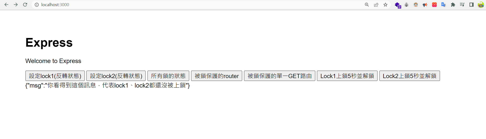

# Express.js的上鎖中間層實作範例(locker-middleware-demo)
此middleware是為了『當路由A已經回應client端但仍在背景長時間處理問題時，
可以確保在路由A完成工作前，經過locker-middleware的路由不會接受到請求』而設計的。
> 此範例的locker中間層取名locker-guard

## 提供簡易(陋)的操作介面

這些按鈕會將呼叫的API的結果顯示在底下，

最左邊兩個按鈕是設定lock1、lock2要不要上鎖，
如果原本是上鎖狀態就會變沒上鎖，沒上鎖就會變有上鎖。

按鈕`所有鎖的狀態`則是可以查看當前lock1、lock2是否被上鎖(true=上鎖、false=沒鎖)

中間那兩個按鈕`被鎖保護的...`則是呼叫『確保當lock1、lock2有一個被上鎖時，會被中間層`locker-guard`攔截回傳訊息』的普通路由

最右邊兩個按鈕則是模擬長時間操作，自動上鎖lock並於5秒後自動解鎖lock的操作。
> 注意: 此範例的設計是如果對應lock已經被上鎖，就不會重複執行長時間操作。
## 安裝
```bash
npm install
```

## 啟動
```bash
npm run start
```

